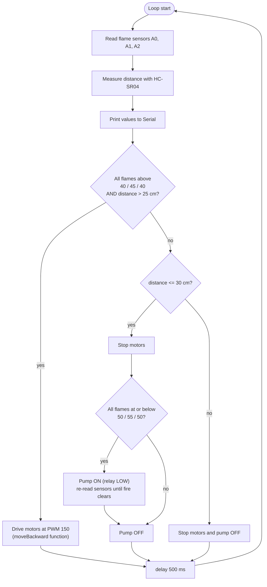

# 🔥 Fire Fighting Robot (Arduino)

[](LICENSE)
-00979D)


An educational, low-cost Arduino robot that senses flames with three analog flame
sensors, keeps clear of obstacles with an ultrasonic sensor, drives two DC motors
through an L298N driver, and switches a water pump through a relay to put the fire out.

> **Status: working prototype / learning project.** It is a bench-scale demonstrator,
> **not** a fire-safety product. See [Safety](#-safety) and
> [Known issues](docs/known-issues.md).

---

## Table of contents

- [Overview](#overview)
- [Features](#features)
- [Repository layout](#repository-layout)
- [Hardware](#hardware)
- [Pin mapping](#pin-mapping)
- [Getting started](#getting-started)
- [How it works](#how-it-works)
- [Configuration](#configuration)
- [Documentation](#documentation)
- [Report vs. code](#report-vs-code-read-this)
- [Roadmap](#roadmap)
- [Safety](#-safety)
- [Contributing](#contributing)
- [License](#license)

## Overview

The robot is designed to detect a flame, move to it, stop at a safe distance and spray
water. The full project write-up (introduction, objectives, components, working principle,
advantages, applications) is available in [`docs/project-report.md`](docs/project-report.md).

Typical uses: educational robotics, embedded-systems teaching, small indoor
fire-response demonstrations, and a base for hazardous-area robotics experiments.

## Features

Implemented in the current firmware (`firmware/fire_fighting_robot`):

- Three analog flame-sensor inputs (`A0`, `A1`, `A2`) with per-sensor thresholds
- HC-SR04 ultrasonic distance measurement for obstacle / stand-off detection
- Relay-controlled water pump (active-LOW relay assumed)
- L298N dual H-bridge motor control using PWM speed (`analogWrite`)
- Serial telemetry at 9600 baud for calibration and debugging

Also included:

- `firmware/manual_joystick_control` - analog-joystick test sketch for verifying the
  motor driver, wiring and motor direction independently of the fire logic

Described in the report as design goals but **not yet in the code**: left/right
direction finding, turning functions and servo-based nozzle sweep. See
[Report vs. code](#report-vs-code-read-this).

## Repository layout

```
fire-fighting-robot/
├── README.md
├── LICENSE
├── CHANGELOG.md
├── CONTRIBUTING.md
├── firmware/
│   ├── README.md                       # sketch overview + upload instructions
│   ├── fire_fighting_robot/            # main autonomous sketch
│   │   └── fire_fighting_robot.ino
│   └── manual_joystick_control/        # motor-driver / joystick test sketch
│       └── manual_joystick_control.ino
├── docs/
│   ├── project-report.md               # the project report, in Markdown
│   ├── hardware.md                     # components, wiring, power
│   ├── software.md                     # firmware architecture + logic
│   ├── testing-and-calibration.md      # bring-up, sensor tuning, test plan
│   └── known-issues.md                 # report-vs-code gaps, bugs, fixes
└── .gitignore
```

> Arduino requires each sketch to live in a folder with the same name as its `.ino`
> file, which is why the sketches are in sub-folders.

## Hardware

| Part | Purpose |
|------|---------|
| Arduino Uno / Nano (ATmega328P) | Main controller |
| 3 x analog flame / IR fire sensors | Detect fire (right, front, left per the report) |
| HC-SR04 ultrasonic sensor | Obstacle / distance detection |
| L298N motor driver | Drives the two DC motors |
| 2 x DC gear motors + chassis and wheels | Locomotion |
| 1-channel relay module | Switches the pump |
| Water pump + tubing/nozzle + reservoir | Extinguishing |
| Servo motor (in report) | Aim the nozzle - *not used by current code* |
| Battery pack(s) | Separate supply for motors/pump is strongly recommended |

Details, wiring tables and power notes: [`docs/hardware.md`](docs/hardware.md).

> The exact Arduino board is not stated in the source material. The pin choices
> (analog `A0-A2`, PWM on `5, 6, 9, 10`) match an **Arduino Uno / Nano**.

## Pin mapping

**Autonomous sketch - `fire_fighting_robot`**

| Signal | Pin | Notes |
|--------|-----|-------|
| Flame sensor 1 / 2 / 3 | `A0` / `A1` / `A2` | Analog; lower reading = stronger flame |
| HC-SR04 `TRIG` | `13` | |
| HC-SR04 `ECHO` | `12` | |
| Relay `IN` (pump) | `7` | Active-LOW assumed |
| L298N `IN1` / `IN2` | `5` / `6` | Motor 1 (PWM) |
| L298N `IN3` / `IN4` | `9` / `10` | Motor 2 (PWM) |

**Test sketch - `manual_joystick_control`**

| Signal | Pin |
|--------|-----|
| Joystick X / Y | `A0` / `A1` |
| L298N `ENA` / `IN1` / `IN2` | `11` / `9` / `8` |
| L298N `IN3` / `IN4` / `ENB` | `7` / `6` / `10` |

## Getting started

### Prerequisites

- [Arduino IDE 2.x](https://www.arduino.cc/en/software) **or** [`arduino-cli`](https://arduino.github.io/arduino-cli/)
- USB cable and the wired robot (see [`docs/hardware.md`](docs/hardware.md))
- No third-party libraries are needed - both sketches use only the Arduino core.

### Clone

```bash
git clone https://github.com/YOUR_USERNAME/fire-fighting-robot.git
cd fire-fighting-robot
```

### Upload with the Arduino IDE

1. Open `firmware/fire_fighting_robot/fire_fighting_robot.ino`.
2. **Tools > Board** > *Arduino Uno* (or your board). Select the correct **Port**.
3. Click **Upload**.
4. Open **Tools > Serial Monitor** at **9600 baud** to watch live sensor values.

### Upload with arduino-cli

```bash
arduino-cli core install arduino:avr
arduino-cli compile --fqbn arduino:avr:uno firmware/fire_fighting_robot
arduino-cli upload  --fqbn arduino:avr:uno -p /dev/ttyUSB0 firmware/fire_fighting_robot
```

**Recommended first run:** upload `manual_joystick_control` with the wheels off the
ground to confirm motor wiring/direction, then follow
[`docs/testing-and-calibration.md`](docs/testing-and-calibration.md) before
running the autonomous sketch.

## How it works

Behaviour of the **current firmware** (checked every loop, then a 500 ms delay):



The *intended* behaviour from the project report:

```
Start -> Read Fire Sensors -> Determine Fire Direction -> Move Toward Fire
      -> Stop -> Activate Pump -> Sweep Servo -> Extinguish Fire -> Continue Monitoring
```

More detail: [`docs/software.md`](docs/software.md).

## Configuration

All tunable values are constants in `firmware/fire_fighting_robot/fire_fighting_robot.ino`:

| Value | Where | Current | Meaning |
|-------|-------|---------|---------|
| Drive thresholds | Condition 1 | `40 / 45 / 40` | Per-sensor readings compared for the drive branch |
| Pump thresholds | Condition 2 `while` | `50 / 55 / 50` | Per-sensor readings that keep the pump on |
| Drive distance | Condition 1 | `> 25` cm | Minimum clear distance to drive |
| Stop distance | Condition 2 | `<= 30` cm | Distance at which the robot stops |
| Drive speed | `moveBackward(150)` | `150` (0-255) | PWM duty |
| Loop delay | end of `loop()` | `500` ms | Polling period |

Sensor modules differ, so re-calibrate for yours - see
[`docs/testing-and-calibration.md`](docs/testing-and-calibration.md).

## Documentation

| Document | Contents |
|----------|----------|
| [Project report](docs/project-report.md) | Introduction, objectives, components, working principle, applications |
| [Hardware](docs/hardware.md) | Bill of materials, wiring tables, power and safety wiring notes |
| [Software](docs/software.md) | Firmware structure, control logic, function reference |
| [Testing & calibration](docs/testing-and-calibration.md) | Bring-up checklist, sensor calibration, test plan |
| [Known issues](docs/known-issues.md) | Report-vs-code gaps, bugs, recommended fixes |
| [Firmware guide](firmware/README.md) | Sketch overview, build and upload |
| [Contributing](CONTRIBUTING.md) | How to propose changes |

## Report vs. code (read this)

The project report and the two sketches were written at different stages and **do not
fully match**. In short:

| Report describes | Code today |
|------------------|-----------|
| Servo sweeps to aim the water | No servo code exists |
| Determines fire direction (right / front / left) and turns toward it | Only forward/backward/stop; no turning |
| Separate forward, backward, left, right, stop functions | `moveForward` and `moveBackward` only (stop = speed 0) |
| Fire sensors only | Also uses an HC-SR04 ultrasonic sensor |

These are documented, not hidden - see [`docs/known-issues.md`](docs/known-issues.md)
for the full list and suggested fixes. The original source files were imported
**unmodified**.

## Roadmap

- [ ] Verify sensor polarity and unify drive/pump thresholds on real hardware
- [ ] Add left/right turning functions and direction finding from the 3 sensors
- [ ] Add servo nozzle sweep (`Servo.h`) while the pump is running
- [ ] Add a pump time-out and non-blocking control loop (`millis()`)
- [ ] Set the relay to its OFF state before `pinMode` to avoid a start-up pulse
- [ ] Add wiring diagram / photos of the built robot
- [ ] Add flame-sensor calibration sketch

## ⚠ Safety

This project involves open flame, water and mains-adjacent electronics.

- Test only with a **small, controlled flame** (e.g. a candle) on a non-flammable
  surface, with a real extinguisher and a supervisor present.
- Keep water away from the Arduino, L298N and batteries; use a **separate supply** for
  the pump and motors, with **common ground** to the Arduino.
- Never leave the robot running unattended.
- The software has no fail-safe (see known issues). It is a teaching prototype and
  must not be relied on for real fire protection.

## Contributing

Contributions are welcome - see [CONTRIBUTING.md](CONTRIBUTING.md). Please describe
larger changes before implementing them.

## License

Released under the [MIT License](LICENSE).
