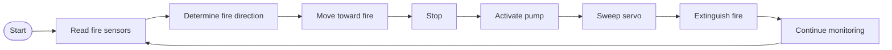

# Fire Fighting Robot Using Arduino - Project Report

> The original project report has been converted to Markdown. Where the report and the
> firmware differ, see [known-issues.md](known-issues.md).

## 1. Introduction

The Fire Fighting Robot is an autonomous robotic system designed to detect and respond to
fire without requiring direct human intervention. The robot uses fire sensors to identify
the direction of a flame, moves toward the detected fire, stops at an appropriate
position, and activates a water pump to extinguish it.

## 2. Objectives

- To detect fire automatically using fire sensors.
- To determine the approximate direction of the fire.
- To move the robot toward the detected fire.
- To stop the robot when the fire is detected.
- To activate a water pump for fire extinguishing.
- To control the direction of water discharge using a servo motor.

## 3. Main Components

| Component | Role |
|-----------|------|
| Arduino | Main controller of the robot |
| Three fire / IR sensors | Detect fire from the right, front, and left directions |
| L298 motor driver | Controls the two motors |
| Two DC motors | Provide movement |
| Servo motor | Directs the fire-extinguishing mechanism |
| Water pump | Supplies water to extinguish the fire |
| Robot chassis and wheels | Provide the mechanical structure and movement |

## 4. Working Principle

The robot continuously reads the values from its three fire sensors. The sensors are
positioned to detect fire from the right, front, and left directions. When a fire is
detected, the robot stops and activates the water pump. The servo motor then moves through
a specified angular range to direct the extinguishing mechanism toward the detected fire.

If the sensor readings indicate that the fire is not immediately in the extinguishing
position, the robot changes its movement direction according to the sensor readings.

## 5. Robot Movement

The L298 motor driver controls the two motors. The program contains separate functions for
forward movement, backward movement, right turning, left turning, and stopping. The robot
changes the motor signals to move toward the detected fire or to adjust its direction.

## 6. Fire Extinguishing Mechanism

When the fire sensor detects a sufficiently strong fire signal, the Arduino activates the
pump. At the same time, the servo motor moves through different angles to direct the
extinguishing mechanism. The servo position is controlled by a pulse signal generated by
the Arduino.

## 7. Control Flow

```
Start -> Read Fire Sensors -> Determine Fire Direction -> Move Toward Fire -> Stop
      -> Activate Pump -> Sweep Servo -> Extinguish Fire -> Continue Monitoring
```



## 8. Advantages

- Autonomous fire detection and response.
- Can operate without continuous human control.
- Can approach potentially dangerous fire locations.
- Uses relatively simple and low-cost electronic components.
- Provides directional fire detection using multiple sensors.

## 9. Applications

- Small indoor fire-response demonstrations.
- Educational robotics projects.
- Fire detection and extinguishing prototypes.
- Hazardous-area robotic research.
- Automation and embedded-system learning.

## 10. Conclusion

The Arduino-based Fire Fighting Robot demonstrates how sensors, motor control, a servo
motor, and a water pump can be integrated into an autonomous robotic system. The robot
monitors three fire-sensor inputs, determines the direction of the detected fire, controls
its movement using the L298 motor driver, and activates the pump and servo mechanism to
extinguish the fire. The project provides a practical demonstration of embedded systems,
robotics, sensor-based decision making, and automation.
